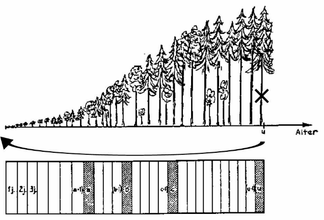
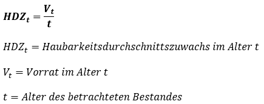
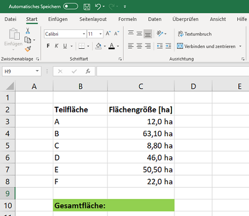
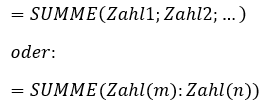
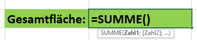
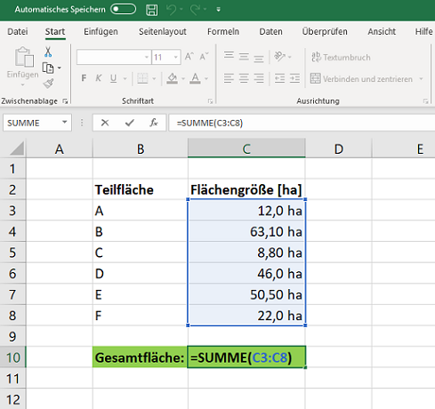
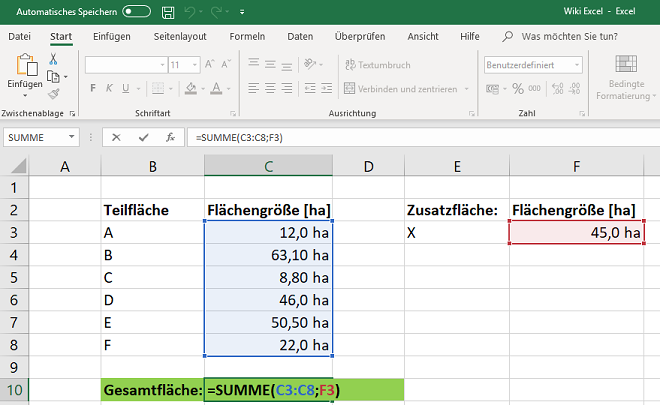

Deckungsbeitragsrechnung - Normalwaldmodell
-------------------------------------------

#### Kurbeschreibung des Modells

Bei diesem Modell handelt es sich um eine Berechnung von
Deckungsbeiträgen auf Grundlage des Normalwaldes. Dazu werden je Baumart
Daten zu Kulturkosten, Holzerntekosten, Pflegekosten, Kosten für
Wegebau- und Unterhaltung, Verwaltungskosten, sonstigen Kosten, Höhen
der Deckungsbeiträge I der Vornutzungen, dem Vorrat am Ende des
Produktionszeitraumes, dem Produktionszeitraum und den
durchschnittlichen Holzerlösen der Endnutzungen benötigt. Als Ergebnis
erhält man die unterschiedlichen Deckungsbeiträge. Durch die
Modellierung der Deckungsbeitragsbeiträge für verschiedene Baumarten im
Normalwald ist es möglich, die Leistung verschiedener Betriebsklassen zu
vergleichen. Zudem dienen Deckungsbeiträge als wichtige unternehmerische
Kennzahl.

<h3>
<a name="menu">Inhaltsverzeichnis</a>
</h3>
<ul>
<li>
<a href="#1. Einleitung">1. Einleitung</a>
</li>
<li>
<a href="#2. Grundlegende Theorie">2. Grundlegende Theorie</a>
</li>
<li>
<a href="#3. Input und Output">3. Input und Output</a>
</li>
<li>
<a href="#4. Aufbau des Modells">4. Aufbau des Modells</a>
</li>
<li>
<a href="#5. Hinweise zur Anwendung">5. Hinweise zur Anwendung</a>
</li>
<li>
<a href="#6. Beispielhafte Anwendung">6. Beispielhafte Anwendung</a>
</li>
<li>
<a href="#7. Literatur">7. Literatur</a>
</li>
</ul>
<h3>
<a name="1. Einleitung">1. Einleitung</a>
</h3>

Die Deckungsbeitragsrechnung dient als geeignetes Instrument zur
Beurteilung von Wettbewerbsverhältnissen: Durch die
Deckungsbeitragsrechnung lassen sich für den Forstbetrieb verschiedene
Kennzahlen errechnen, die als Entscheidungsgrundlage dienen können. Auf
Basis einer Deckungsbeitragsrechnung kann der kalkulatorische
Betriebserfolg für ganze Betriebsklassen mit Hilfe relativ weniger
Eingangsdaten ermittelt werden. Als Kosten- bzw. Erlösträger dient dabei
z. B. ein Hektar eines bestimmten Bestandes oder einer Baumart. Die
vorliegende Deckungsbeitragsrechnung wird unter der Voraussetzung des
Normalwaldes durchgeführt. Der mehrstufige Deckungsbeitrag
berücksichtigt unterschiedliche Kosten. Dadurch erlaubt er spezifischere
Aussagen zum Beitrag des Produkts zum Betriebsergebnis. Es kann auch
geklärt werden, für welchen Preis ein Produkt angeboten werden kann, um
noch profitabel zu sein.

<h3>
<a name="2. Grundlegende Theorie">2. Grundlegende Theorie</a>
</h3>

Die Deckungsbeitragsrechnung gehört zur *Kosten- und Leistungsrechnung*.
Dabei wird ein Deckungsbeitrag definiert als die Differenz einer
Leistung (Erlös) und den Teilkosten. Ein Beispiel für einen
Deckungsbeitrag ist der Erlös aus der Holzernte und der damit im
Zusammenhang entstandenen Erntekosten. Die Deckungsbeitragsrechnung kann
auch schrittweise erfolgen. Dies wird in der Forstwirtschaft oft
angewandt, um Kennzahlen für den Forstbetrieb zu errechnen. Dabei nimmt
der Deckungsbeitrag I Bezug zu variablen Kosten, während die folgenden
Deckungsbeiträge auf Fixkosten aufbauen.

Der <ins> Deckungsbeitrag I </ins> wird auch erntekostenfreier Holzerlös
genannt. Dementsprechend wird hier die Differenz der Erlöse aus dem
Holzverkauf und der Kosten der Holzernte betrachtet. Es handelt sich
beim Deckungsbeitrag I um variable Kosten.

Der <ins> Deckungsbeitrag II </ins> wird auch waldbaulicher
Deckungsbeitrag genannt. Dies entspricht der Differenz zwischen dem DB I
und den produktspezifischen Fixkosten. In der Forstwirtschaft
entsprechen die produktspezifischen Fixkosten den Kosten für die
Kulturbegründung und Bestandespflege.

Der <ins> Deckungsbeitrag III </ins> entspricht der Differenz aus dem DB
II und den produktgruppenspezifischen Fixkosten. In der Forstwirtschaft
sind zum Beispiel Kosten für Wegebau und -unterhaltung
produktgruppenspezifische Fixkosten.

Der <ins> Deckungsbeitrag IV </ins> entspricht der Differenz aus dem DB
III und den sonstigen Kosten (Bereichsfixkosten).

Der <ins> Deckungsbeitrag V </ins> wird auch *Reinertrag* genannt. Er
entspricht der Differenz aus dem DB IV und den Verwaltungskosten
(Betriebsfixkosten).

Das vorliegende Modell zur Kalkulation von Deckungsbeiträgen beruht auf
dem Konzept des Normalwaldmodelles. Dieses wurde 1826 von HUNDESHAGEN
entworfen und stellt das denkbar einfachste Modell eines nachhaltigen
Forstbetriebes dar. In diesem Modell steht die Frage im Raum, wie ein
Wald theoretisch beschaffen sein müsste, um jährlich konstante
(Holz-)Erträge zu liefern.

Das Normalwaldmodell unterliegt bestimmten Annahmen und Bedingungen, die
Voraussetzung für eine Anwendung sind:

1.  Der Wald besteht aus einer Baumart oder homogene Mischung.
2.  Alle Altersstufen vom Alter 1 bis zum Alter u (Umtriebszeit) sind
    mit gleicher Fläche vertreten; Blößen sind nicht vorhanden.
3.  Homogene Standortsverhältnisse, so dass *Ertragsklasse* und
    Zuwachspotential auf der gesamten Fläche gleich sind.
4.  Der *Bestockungsgrad* ist überall gleich, z.B. 1,0.
5.  Die Holzqualität ist in allen Beständen einheitlich.
6.  Die räumliche Ordnung der Bestände ist vollständig; d.h. die
    Bestandeshöhen (Bestandesalter) sind gegen die Hauptgefahrenrichtung
    so abgestuft, dass jeder Bestand im Alter der Umtriebszeit ohne
    Gefahr für die Nachbarbestände geerntet werden kann.
7.  Es existieren keine *Risiken* (z.B. Sturm, Borkenkäfer), durch die
    Bestände ausfallen.

Als Ansatz des Modells teilt man die Waldfläche eines Forstbetriebes in
u gleichgroße Flächen f vom Alter 1 bis u Jahre. Dabei entspricht u der
Umtriebszeit. Beispielsweise wird von einer *Umtriebszeit* von 100
Jahren ausgegangen. Somit teilt man die Fläche des Forstbetriebes in 100
gleich große Flächen.

Im Normalwaldmodell sind jährlicher Zuwachs und *jährliche Nutzung* nach
Volumen und Wert gleich und *Ertrag* und *Aufwand* sind jährlich
konstant (stationärer Gleichgewichtszustand eines dynamischen Systems)

*Bildliche Darstellung eines Normalwaldes (aus SPEIDEL, 1972, S. 100)*

<ins>
Formeln:
</ins>

Der *Haubarkeitsdurchschnittszuwachs HDZ* im Alter t ist der Quotient
aus dem Vorrat des verbleibenden Bestandes im Alter t und dem
Bestandesalter t. Es entspricht dem durchschnittlichen jährlichen
Endnutzungsvolumen je ha und Jahr in einem Normalwald.

Wenn nicht von HDZt, sondern von HDZu die Rede ist, bezieht sich der
Haubarkeitsdurchschnittszuwachs auf den gesamten Umtriebszeitraum u. In
der oben genannten Formel wird hier lediglich das “t” durch das “u”
ersetzt.

<h3>
<a name="3. Input und Output">3. Input und Output</a>
</h3>

Der <strong> Input </strong> für das Modell setzt sich zusammmen aus:

-   Holzerntekosten (Holzernte und Holzbringung) \[Efm/ha\]
-   Kulturkosten (Flächenvorbereitung, Kosten je Pflanze (Material +
    Pflanzung)) \[€/ha\]
-   Pflegekosten (Läuterung + Astung) \[€/ha\]
-   Kosten für Wegebau und -unterhaltung \[€/ha\]
-   Sonstige Kosten \[€/ha\]
-   Verwaltungskosten \[€/ha\]
-   Höhe der Deckungsbeiträge I der Vornutzungen in % des DB I der
    Endnutzung
-   Vorrat am Ende des Produktionszeitraumes \[Vfm\]
-   Produktionszeitraum \[Jahre\]
-   Durchschnittlicher Holzerlös der Endnutzung je Baumart \[€/Efm\]

Aus dem Modell ergeben sich folgende <strong> Outputgrößen </strong>:

-   DB I (erntekostenfreier Holzerlös), DB II (Waldbaulicher
    Deckungsbeitrag), DB III, DB IV, DB V (Reinertrag) je Baumart

Durch die Modellierung der Deckungsbeitragsbeiträge für verschiedene
Baumarten im Normalwald ist es möglich, die Leistung verschiedener
Betriebsklassen zu vergleichen. Zudem können mit dem Deckungsbeitrag die
Produkte (Baumarten) ermittelt werden, die Erfolgsbeiträge liefern (es
werden Gewinne erzielt). Wird der Deckungsbeitrag je Baumart ermittelt
erhält man genaue Aussagen darüber, welche Baumarten einen hohen Beitrag
zur Deckung der Fixkosten liefern. Somit können auch Aussagen getroffen
werden, wo eine Optimierung möglich bzw. notwendig wäre, um den
Reinertrag zu erhöhen. Zudem ist der Deckungsbeitrag eine wichtige
unternehmerische Kennzahl. Er ist ein wichtiges Hilfsmittel, um das
eigene Produktportfolio anzupassen und zu optimieren. Zudem dient er
auch als Vergleichsgröße für den Vergleich mit anderen Betrieben. Die
Deckungsbeitragsrechnung ist gut geeignet, um für einzelne Produkte den
Betrag zu ermitteln, den diese zum Betriebsergebnis beitragen. Zudem
dient er auch als Grundlage für weiterführende Kalkulationen.

<h3>
<a name="4. Aufbau des Modells">4. Aufbau des Modells</a>
</h3>

<h3>
<a name="5. Hinweise zur Anwendung">5. Hinweise zur Anwendung</a>
</h3>

Für die Berechnung des Modells ist die Excel-Funktion „Summe“ hilfreich:Will man die Zelleninhalte mehrerer Zellen aufsummieren, lässt sich dasmit der Excelfunktion <strong> „SUMME()“ </strong> bewerkstelligen:

In das Zielfeld wird also die genannte Funktion eingegeben:

Direkt unter der Zielzelle erscheint während der Eingabe ein kleines
Feld, das den Aufbau der Funktion erklärt. In diesem Fall steht dort:
<strong> =SUMME(Zahl1; Zahl2; …) </strong>

Nun können hier einzelne Werte, bzw. Felder eingetragen werden, die alle
mit einem Semikolon getrennt werden müssen. Eine weitere Möglichkeit
besteht darin, einen „von-bis-Wert“ einzutragen. Dazu müssen die
entsprechenden Felder mit der Maus markiert warden

Durch Bestätigen mit der Enter-Taste auf der Tastatur wird die Formel
gespeichert und ausgeführt.

Die beiden aufgeführten Varianten (durch Semikolon getrennte Einzelwerte
und „von-bis-Werte“) lassen sich auch kombinieren:

<h3>
<a name="6. Beispielhafte Anwendung">6. Beispielhafte Anwendung</a>
</h3>

Ermitteln Sie auf dem anliegenden Blatt mit den nachfolgenden
Eingangsdaten den kalkulatorischen Reinertrag einer durchschnittlichen
Buchen-, Eichen- und Douglasien-betriebsklasse! Gehen Sie dabei von
einem erntefähigen, hiebsreifen Endnutzungsbestand aus.

1.  Ermitteln Sie den Holzvorrat der Endnutzungsbestände in Vfm/ha für
    Buche (Lkl. 9), Eiche (Lkl. 6) und Douglasie (Lkl. 16) mit Hilfe der
    Ertragstafeln (Kapitel 3 in „Arbeitsmaterialien zur
    betriebswirtschaftlichen Kalkulation, Forstplanung und
    Waldbewertung“). Berechnen Sie den Haubarkeitsdurchschnittszuwachs
    (HDZu) in Efm! Der HDZu verteilt den Vorrat (Vfm) des
    Endnutzungsbestandes, abzüglich 20% Ernteverlust (Efm), im Alter der
    Umtriebszeit auf die Länge der Umtriebszeit. Gehen Sie dabei von
    einer Umtriebszeit von 120 Jahren für Buche, 160 Jahren für Eiche
    und 80 Jahren für Douglasie aus.

2.  Durchschnittliche Holzverkaufserlöse der einzelnen Baumarten sind
    ebenso wie Kostensätze der Holzernte (motormanuell) und Holzrückung
    im Vorlesungsskript enthalten. Legen Sie die Erlöse und die Kosten
    mit Hilfe des HDZu bzw. der Umtriebszeit auf den Hektar um! Der
    Deckungsbeitrag I aus Vornutzung soll als Zuschlag des
    Deckungsbeitrags I aus Endnutzung kalkuliert werden. Entsprechende
    Zuschläge sind im Skript gegeben und auf der Lösungsvorlage bereits
    eingefügt.

3.  Die Kulturkosten der Baumarten setzen sich aus der
    baumartenspezifischen Pflanzenzahl je Hektar und den Pflanzkosten
    (Rhodener Verfahren) zusammen. Berücksichtigen Sie zusätzlich für
    alle Baumarten eine vorbereitende Flächenräumung mittels Forwarder
    sowie eine einmalige Läuterung. Die 80 besten Douglasien sollen auf
    eine Höhe von 6m geästet werden (Kalkulationsgrundlagen im Skript).

4.  Für Wegebau können 15,00 €/a/ha, für sonstige jährliche Kosten
    jeweils 10,00 €/a/ha und für die Verwaltungskosten jeweils 115,00
    €/a/ha veranschlagt werden. Welche Gründe sehen sie für die deutlich
    abweichenden Reinerträge der Baumarten Buche, Eiche und Douglasie?

##### Datengrundlage

[06\_Deckungsbeitragsrechnung\_Normalwald\_Blanko.xlsx](./6_Deckungsbeitragsrechnung_Normalwald_Blanko.xlsx)

##### Musterlösung

[06\_Deckungsbeitragsrechnung\_Normalwald\_Loesung.xlsx](./06_deckungsbeitragsrechnung_normalwald/-/blob/master/6_Deckungsbeitragsrechnung_Normalwald_Loesung.xlsx)

<h3>
<a name="7. Literatur">7. Literatur</a>
</h3>

<strong >Möhring, B. et al. (2020): </strong> Vorlesungsskript
Forstliche Betriebswirtschaftslehre Bachelor. Abteilung Forstökonomie
und Forsteinrichtung des Burckhard-Instituts, Forstliche Fakultät der
Universität Göttingen

<strong>sevDesk: </strong> Deckungsbeitrag. Hg. v. sevDesk GmbH. Online verfügbar unter https://sevdesk.de/lexikon/deckungsbeitrag/, zuletzt geprüft am 29.07.2020.

<a href="#menu">zurück zum Inhaltsverzeichnis</a>

